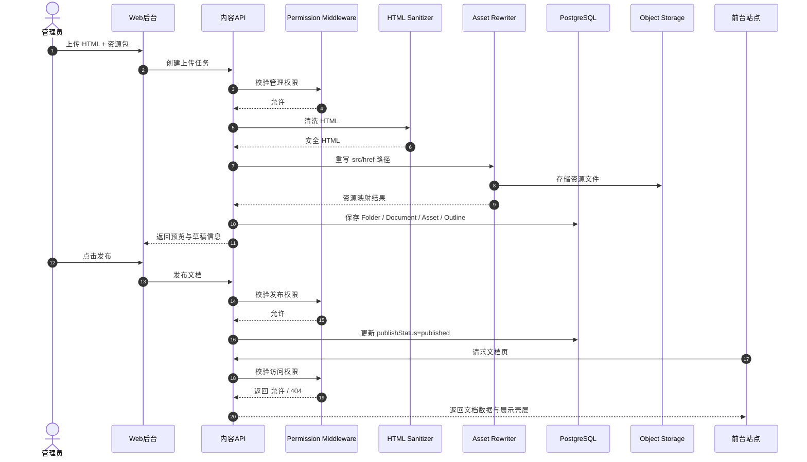

# 文览 PRD

## 1. 产品命名

### 推荐名称
- 中文名：文览
- 英文工作名：Wenlan Docs
- 一句话定位：把各种文档，做成可阅读、可检索、可控权限的在线展台。

### 命名说明
- `文`：覆盖 SOP、教程、方案、报告、手册、案例、知识卡片等各类文档。
- `览`：强调在线展示、浏览、发现与阅读，而不是单纯存储。
- 名称边界足够宽，不会把产品限定死在 `SOP` 这一个场景里。

## 2. 核心目标 (Mission)

让各类文档都能以清晰、美观、安全的方式在线展示，并支持分类、权限控制与后续智能化整理。

## 3. 产品定位

文览不是网盘，也不是传统 CMS。  
它是一个以“文档展示”为核心的内容平台：

- 前台负责文档的发现、浏览、阅读与分享。
- 后台负责文档的上传、归类、权限控制与发布。
- AI 与 CLI 是后续增强层，不是首发必需品。

当前阶段，`SOP 知识库` 是最重要的一类内容，但不是唯一内容类型。

## 4. 用户画像 (Persona)

### 4.1 内容管理员
- 需要持续上传和整理大量文档。
- 希望像管理文件一样管理内容，但不想手动维护路由和发布逻辑。
- 核心痛点：分类混乱、权限复杂、预览发布割裂。

### 4.2 内容运营 / 协作者
- 需要快速维护标题、标签、说明、封面与权限。
- 希望未来能借助 AI 提高整理效率。
- 核心痛点：重复劳动多，内容一多就难管理。

### 4.3 访客 / 注册用户
- 只想快速找到自己能看的内容。
- 更关心阅读体验，而不是后台结构。
- 核心痛点：资料散、入口乱、页面不好读。

## 5. 设计方向

### 5.1 已确认原型方向
- 结构采用：方案 2 `知识桌面`
- 视觉采用：方案 1 `纸上展墙`

### 5.2 最终设计语言
- 前台：有品牌感的“手绘文档展台”
- 后台：高效率的“知识工作台”
- 总体气质：内容优先、阅读友好、带一点纸张和手绘温度

### 5.3 视觉原则
- 公共页面不做通用 SaaS 风格，保留纸张纹理、手绘边线、便签和高亮元素。
- 后台管理器保持结构理性、操作高效，但沿用统一设计 token。
- 移动端默认支持卡片/列表切换，避免纯卡片在窄屏信息密度过低。

## 6. V1: 最小可行产品 (MVP)

### 6.1 核心能力
- 邀请制登录
- 首页文档展台
- 文件夹页
- 文档页
- 后台资源管理器
- HTML 文档上传与静态资源管理
- 标签系统
- 基础搜索
- 4 级核心权限
- 基础无障碍
- 基础安全上线能力

### 6.2 首页
- 展示 3 篇高质量种子文档
- 提供搜索框
- 提供标签/分类筛选
- 提供卡片/列表视图切换
- 提供“联系我/合作咨询”入口，跳转到 `https://www.hnwen17.top`

### 6.3 路由模型
- `/{folderPath}`：文件夹页，展示子文件夹和文档卡片
- `/{folderPath}/{documentSlug}`：文档页，展示文档内容

### 6.4 文件夹页
- 面包屑导航
- 子文件夹展示
- 文档卡片与列表展示
- 标签与权限徽标
- 排序与筛选

### 6.5 文档页
- 手绘风格阅读壳层
- HTML 文档展示
- 长文档目录导航
- 阅读友好的正文布局
- “复制公众号格式”入口预留，正式能力放后续版本
- 未发布预览状态可区分

### 6.6 后台资源管理器
- 文件夹树
- 图墙视图
- 列表视图
- 新建、重命名、移动、删除
- 手动排序
- 预览
- 右键菜单
- 键盘可达的“更多操作”
- 右侧实时预览面板

### 6.7 HTML 上传
- 支持上传 HTML 主文件及关联静态资源
- 支持相对路径资源重写
- 支持文件类型白名单
- 支持文件大小限制
- V1 禁止自定义脚本执行

### 6.8 权限系统
V1 先收敛为 4 个核心访问级别：

- `未发布`
- `公开`
- `仅登录用户`
- `私有`

同时支持：

- `继承父级`
- 子项只能更严格，不能比父项更开放

### 6.9 基础无障碍
- 全站键盘可操作
- 焦点可见
- 语义结构明确
- 对比度达标
- 右键菜单具备无障碍替代操作入口
- 支持减少动态效果

## 7. 版本路线图 (Detailed Releases)

### 7.1 版本总览

| 版本 | 核心目标 | 主要对象 | 关键词 |
|------|----------|----------|--------|
| V1 | 先把文档展示、上传、权限、安全跑通 | 管理员 + 访客 | 展示 / 上传 / 权限 |
| V1.5 | 补齐管理效率和外部工作流入口 | 管理员 / 运营 | AI / CLI / 精细权限 |
| V2 | 建立“导入 -> 结构化 -> 生成 -> 发布”闭环 | 内容生产者 | 导入 / Skill / 版本 |
| V3 | 平台化与商业化 | 协作者 / 高级用户 / 付费用户 | 生态 / 变现 / 开放能力 |

### 7.2 V1: MVP 详细说明

#### 7.2.1 版本目标
- 建立可用、可信的文档展示底座。
- 证明“在线展示各种文档”这一核心价值成立。
- 在不牺牲安全的前提下完成首发。

#### 7.2.2 用户价值
- 管理员可以把文档稳定发布出去。
- 访客可以清晰浏览和阅读内容。
- 平台可以承载 SOP，但不被 SOP 限定。

#### 7.2.3 必须完成的模块
- 邀请制登录
- 首页文档展台
- 文件夹页与文档页路由
- 后台资源管理器
- HTML 上传、静态资源处理、预览
- 4 级核心权限
- 标签与基础搜索
- 基础无障碍
- 安全上线清单

#### 7.2.4 不做的事情
- 不做开放注册
- 不做全文搜索
- 不做 AI 自动执行
- 不做 CLI
- 不做微信公众号草稿箱推送
- 不做在线 HTML 编辑器
- 不做会员体系

### 7.3 V1.5: 管理效率增强版

#### 7.3.1 版本目标
- 让管理员“管理得更细、整理得更快、输出得更顺”。
- 在不改动核心内容模型的前提下，补齐首批增强能力。

#### 7.3.2 目标用户
- 高频上传和整理内容的管理员
- 对批量处理和效率工具有需求的运营协作者
- 习惯命令行和自动化的高级用户

#### 7.3.3 核心功能

##### A. 精细化权限
- `仅指定用户可见`
- `用户组可见`
- 管理权限分层：
  - 管理员
  - 编辑者
  - 发布者
  - 只读协作者

##### B. AI 管理助手
- 建议分类
- 建议标签
- 建议标题与摘要
- 建议 slug
- 检查权限风险
- 检查无障碍问题
- 展示 `confidence score`
- 支持“跳过 AI 分析”
- 缓存首次分析结果，避免同一文档重复计费和结果漂移

##### C. CLI Alpha
- `wenlan init`
- `wenlan login`
- `wenlan import`
- `wenlan build`
- `wenlan preview`
- `wenlan push web`
- `wenlan config`
- `wenlan list`

CLI 定位：
- 是受控客户端，不是权限本体
- 所有写操作都必须走服务端 API

##### D. 公众号转换基础版
- 页面详情页提供“复制公众号格式”
- CLI 支持 `convert wechat`
- CSS 内联化
- 兼容性降级
- 优先支持复制到剪贴板

##### E. 审计日志
- 记录谁在什么时候做了什么关键操作
- 覆盖上传、移动、删除、发布、改权限、批量操作

#### 7.3.4 业务规则
- AI 默认不落库，必须管理员确认后执行。
- CLI 调用必须携带受限 scope。
- 白名单权限支持单用户和用户组两种主体。
- 公众号转换结果不能反向污染原始 HTML。

#### 7.3.5 非目标
- 不做自定义 Skill UI
- 不做公众平台群发
- 不做浏览器插件

### 7.4 V2: 内容生产闭环版

#### 7.4.1 版本目标
- 从“展示文档”升级为“把各种来源文档导入、整理、结构化并生成展示页”。
- 建立平台自己的内容生产能力，而不是只接收现成 HTML。

#### 7.4.2 核心功能

##### A. 多来源导入
- 飞书文档
- 网页 URL
- Markdown
- PDF
- Word
- 纯文本

##### B. Skill 引擎
- `general-skill`
- 垂直领域 skill
- 三件套：
  - `prompt.md`
  - `schema.json`
  - `template.html`
- 支持变量插值
- 支持输出 JSON Schema 校验
- 支持 few-shot 示例

##### C. 结构化生成链路
- 原始文档导入
- 提取结构化 JSON
- 生成主题化 HTML
- 预览
- 发布到文览站点

##### D. 版本与恢复
- 版本历史
- 文档回滚
- 回收站
- 软删除
- 恢复入口

##### E. 批量操作增强
- Shift 多选
- 批量改标签
- 批量改权限
- 批量移动
- 批量发布

##### F. 编辑一致性
- `version` 字段
- 乐观锁
- 并发编辑提示

##### G. SEO 精细化控制
- 独立 meta
- noindex 控制
- sitemap
- 面向公开内容的索引策略

##### H. 数据看板
- PV/UV
- 热门文档
- 更新时间分布
- 搜索热词

#### 7.4.3 业务规则
- 原始导入内容与生成内容分开保存。
- 每次 Skill 运行都生成独立 run 记录。
- 已发布文档回滚时需要生成新版本，不直接破坏历史版本。
- 回收站项目在彻底删除前保留可恢复窗口。

#### 7.4.4 非目标
- 不做开放的 Skill 社区分发
- 不做复杂实时协作编辑

### 7.5 V3: 平台化与商业化版本

#### 7.5.1 版本目标
- 让文览从“你自己的文档平台”变成“别人也可以用的文档基础设施”。
- 打开开放能力和商业化路径。

#### 7.5.2 核心功能

##### A. 自定义 Skill
- 创建自定义 Skill
- 调试 prompt/schema/template
- 管理 Skill 版本

##### B. Skill 市场
- 发布 Skill
- 安装 Skill
- 评分与版本兼容信息

##### C. 在线转换工具页
- 粘贴 HTML
- 一键转公众号格式
- 复制 / 下载
- 作为独立获客页

##### D. 会员与商业化
- 会员可见内容
- 套餐与配额
- 团队版与个人版
- 高级导入额度 / AI 调用额度

##### E. 开放能力
- API Token
- Webhook
- 自动化工作流
- 外部系统接入

##### F. 多主题文档体系
- 主题切换
- 行业模板
- 企业品牌主题

#### 7.5.3 业务规则
- Skill 市场中的 Skill 需要版本兼容声明。
- 商业化权限与访问权限分开建模。
- 外部 API Token 只能拥有最小必要 scope。
- 在线转换工具默认不读取用户私有文档，除非显式授权。

#### 7.5.4 非目标
- 不做开放社交社区
- 不做泛文档编辑器替代品
- 不做无限制公共托管服务

## 8. 关键业务逻辑 (Business Rules)

### 8.1 内容模型
- 平台操作的是“内容资产模型”，不是操作系统真实文件结构。
- 文件夹用于组织展示和管理。
- 文档用于承载最终可访问页面。
- 静态资源归属于文档。

### 8.2 路由规则
- 同一父级下，文件夹 slug 与文档 slug 不允许重名。
- 如 slug 冲突，系统自动建议重命名，例如追加 `-2`。
- 路由由 slug 自动生成。

### 8.3 权限规则
- 文件夹权限默认向下继承。
- 子项可更严格，不可更开放。
- `未发布` 优先级最高。
- 所有前台访问、搜索、直接 URL 命中都必须经过服务端权限校验。
- 无权限访问返回 `404`，而不是 `403`。

### 8.4 发布与预览
- 草稿和已发布是两套状态。
- 管理员可通过 `draft preview` 访问未发布内容。
- 普通用户永远不能看到未发布内容的真实信息。

### 8.5 排序规则
- 文件夹和文档均使用整数 `order` 字段排序。
- V1 允许拖拽交互，但最终落库为整数序号。

### 8.6 搜索规则
- 搜索结果必须按当前用户权限过滤。
- 不允许返回“标题可见但正文无权访问”的泄露型结果。
- V1 先做标题、标签、路由、文件夹名搜索，不做全文检索。

### 8.7 HTML 安全规则
- 上传时必须做 HTML sanitize。
- 渲染时必须附加 CSP 约束。
- 前台文档展示与后台管理认证上下文必须隔离。
- 资源路径统一重写，不信任原始相对路径。

### 8.8 未来权限规则
- `指定用户可见` 与 `用户组可见` 属于 V1.5 能力。
- 管理权限和访问权限必须分开计算。
- 当访问权限与会员权限冲突时，以“更严格的一方”为准。

### 8.9 AI 规则
- AI 只提供建议和产物，不拥有最终决策权。
- AI 建议必须保留来源、时间、模型和置信度。
- 低置信度建议默认以待确认状态展示。
- 用户修正过的 AI 建议结果应优先被缓存和复用。

### 8.10 导入与生成规则
- 原始导入文档不可被直接覆盖，需保留原始快照。
- Skill 生成的 HTML 属于派生内容，需记录生成链路。
- 任一导入源都必须先落标准化中间结构，再进入渲染流程。

### 8.11 公众号转换规则
- 转换结果为独立产物，不回写原文档正文。
- 公众号兼容处理优先保障“可粘贴可发布”，其次才是完全视觉一致。
- 剪贴板复制优先于草稿箱推送，因其可靠性更高。

### 8.12 版本与删除规则
- V2 开始支持软删除与恢复。
- 已发布内容的历史版本不可被无痕覆盖。
- 删除文档时，其资源文件进入延迟清理队列，而非立即硬删除。

## 9. 数据契约 (Data Contract)

### 9.1 SiteSettings
- `siteTitle`
- `siteSubtitle`
- `heroDescription`
- `contactLabel`
- `contactUrl`

### 9.2 User
- `id`
- `email`
- `displayName`
- `role`
- `status`
- `createdAt`

### 9.3 InviteToken
- `id`
- `email`
- `token`
- `expiresAt`
- `usedAt`
- `createdBy`

### 9.4 Folder
- `id`
- `parentId`
- `name`
- `slug`
- `description`
- `coverImage`
- `order`
- `accessMode`
- `createdBy`
- `createdAt`
- `updatedAt`

### 9.5 Document
- `id`
- `folderId`
- `title`
- `slug`
- `routePath`
- `summary`
- `thumbnail`
- `sourceType`
- `entryAssetId`
- `publishStatus`
- `accessMode`
- `order`
- `createdBy`
- `createdAt`
- `updatedAt`

### 9.6 DocumentAsset
- `id`
- `documentId`
- `fileName`
- `mimeType`
- `storagePath`
- `publicUrl`
- `checksum`
- `size`

### 9.7 Tag
- `id`
- `name`
- `slug`

### 9.8 DocumentTag
- `documentId`
- `tagId`

### 9.9 AccessGrant
- `id`
- `targetType`
- `targetId`
- `subjectType`
- `subjectId`
- `accessLevel`

### 9.10 DocumentOutline
- `id`
- `documentId`
- `level`
- `text`
- `anchor`
- `order`

### 9.11 AiSuggestion
V1 预留，不强制上线。

- `id`
- `targetType`
- `targetId`
- `suggestionType`
- `payload`
- `confidence`
- `status`
- `reviewedBy`

### 9.12 UserGroup
V1.5 新增。

- `id`
- `name`
- `slug`
- `description`
- `createdAt`

### 9.13 GroupMember
V1.5 新增。

- `groupId`
- `userId`
- `role`

### 9.14 AuditLog
V1.5 新增。

- `id`
- `actorId`
- `action`
- `targetType`
- `targetId`
- `beforePayload`
- `afterPayload`
- `createdAt`

### 9.15 CliToken
V1.5 新增。

- `id`
- `userId`
- `tokenHash`
- `scopes`
- `expiresAt`
- `lastUsedAt`

### 9.16 SourceImport
V2 新增。

- `id`
- `documentId`
- `sourceType`
- `sourceRef`
- `rawSnapshotPath`
- `importStatus`
- `createdAt`

### 9.17 SkillDefinition
V2 新增。

- `id`
- `name`
- `version`
- `entryPath`
- `promptPath`
- `schemaPath`
- `templatePath`
- `status`

### 9.18 SkillRun
V2 新增。

- `id`
- `skillId`
- `sourceImportId`
- `model`
- `inputHash`
- `outputPath`
- `runStatus`
- `cost`
- `createdAt`

### 9.19 DocumentVersion
V2 新增。

- `id`
- `documentId`
- `versionNumber`
- `snapshotPath`
- `changeSummary`
- `createdBy`
- `createdAt`

### 9.20 RecycleBinEntry
V2 新增。

- `id`
- `targetType`
- `targetId`
- `deletedBy`
- `deletedAt`
- `restoreDeadline`

### 9.21 PublishArtifact
V1.5 / V2 新增。

- `id`
- `documentId`
- `artifactType`
- `format`
- `storagePath`
- `status`
- `createdAt`

### 9.22 ShareLink
V3 新增。

- `id`
- `targetType`
- `targetId`
- `token`
- `expiresAt`
- `maxVisits`
- `createdBy`

### 9.23 MembershipPlan
V3 新增。

- `id`
- `name`
- `price`
- `billingCycle`
- `featureFlags`

### 9.24 AnalyticsEvent
V2 新增。

- `id`
- `eventType`
- `documentId`
- `userId`
- `sessionId`
- `payload`
- `createdAt`

## 10. MVP 原型设计与确认

### 10.1 方案确认
- 结构：知识桌面
- 视觉：纸上展墙

### 10.2 设计说明
- 首页像一个有品牌感的文档展台，而不是后台入口页。
- 文件夹页兼顾发现与组织。
- 文档页优先保障阅读体验。
- 后台像一个高效率的内容工作台。

### 10.3 原型图

#### 首页
```text
+----------------------------------------------------------------------------------+
| 文览 LOGO                 [搜索文档 / 标签 / 路由________________] [登录] [联系我] |
|----------------------------------------------------------------------------------|
| 手绘标题：把各种文档，做成可阅读的在线展台                                       |
| 副文案：SOP / 教程 / 手册 / 报告 / 案例                                           |
|                                                                                  |
| [精选文档 #1]      [精选文档 #2]      [精选文档 #3]                               |
| 封面+标题          封面+标题          封面+标题                                  |
| 标签 更新时间      标签 更新时间      标签 更新时间                              |
|                                                                                  |
| 标签筛选: [全部] [SOP] [教程] [运营] [AI] [报告]                                 |
| 视图切换: [卡片] [列表]                                                           |
|                                                                                  |
| [文件夹卡片] [文件夹卡片] [文档卡片] [文档卡片]                                   |
+----------------------------------------------------------------------------------+
```

#### 文件夹页
```text
+----------------------------------------------------------------------------------+
| 首页 / 运营文档                                    [卡片] [列表=ON] [筛选]       |
|----------------------------------------------------------------------------------|
| 文件夹简介：运营相关 SOP、案例、模版、复盘                                        |
| 权限徽标：公开                                                                     |
|                                                                                  |
| 子文件夹： [选题] [标题] [投放] [复盘]                                            |
|----------------------------------------------------------------------------------|
| 名称                   类型       标签               更新时间            操作       |
|----------------------------------------------------------------------------------|
| 标题模版合集            文档       标题 / SOP         2026-04-16         [⋯]      |
| 爆款开头库              文档       模版 / 写作        2026-04-15         [⋯]      |
| 客户案例                文档       私有               2026-04-12         [⋯]      |
+----------------------------------------------------------------------------------+
```

#### 文档页
```text
+----------------------------------------------------------------------------------+
| 首页 / 运营文档 / 爆款开头库                [公开] [复制公众号格式] [联系我]      |
|----------------------------------------------------------------------------------|
| 左：目录导航              | 中：手绘纸张阅读区                        | 右：信息区 |
|---------------------------|-------------------------------------------|-------------|
| 01 开头的任务             | 标题                                      | 标签        |
| 02 常见错误               | 摘要                                      | 作者        |
| 03 三种结构               | 荧光笔 / 便签 / checklist / 时间线         | 更新时间    |
| 04 示例                   | 安全渲染后的 HTML 内容                     | 相关推荐    |
+----------------------------------------------------------------------------------+
```

#### 后台资源管理器
```text
+----------------------------------------------------------------------------------+
| 文览后台         [上传文档] [新建文件夹] [批量操作] [搜索_________] [用户菜单]    |
|----------------------------------------------------------------------------------|
| 左：目录树                | 中：资源区                                | 右：预览区   |
|---------------------------|-------------------------------------------|--------------|
| 文档库                    | [卡片/列表切换]                           | 页面预览      |
| ├─ SOP                    | 标题模版合集      公开     已发布   [⋯]    | 标题/slug     |
| ├─ 教程                   | 爆款开头库        公开     草稿     [⋯]    | 权限/标签     |
| ├─ 报告                   | 客户案例          私有     草稿     [⋯]    | 目录抽取      |
| └─ 案例                   |                                      | [预览][保存] |
+----------------------------------------------------------------------------------+
```

## 11. 架构设计蓝图

### 11.1 核心流程图


### 11.2 组件交互说明

当前工作区为空目录，本次属于绿地项目规划，没有既有文件需要兼容修改。  
以下是建议的首期模块结构：

```text
/apps/web
  /app
    /(public)
      /page.tsx
      /[...slug]/page.tsx
    /admin
      /page.tsx
      /documents/page.tsx
      /folders/page.tsx
    /api
      /auth/*
      /documents/*
      /folders/*
      /search/*
      /upload/*
  /components
    /public/*
    /admin/*
    /shared/*
  /lib
    /auth/*
    /permissions/*
    /content/*
    /search/*
    /upload/*
    /html-sanitize/*
    /asset-rewrite/*
    /outline/*
    /security/*
  /styles/*

/packages/core
  /schemas/*
  /types/*
  /constants/*

/packages/cli
  V1.5 再启用

/packages/ai
  V1.5 再启用

/packages/importers
  V2 再启用

/packages/skills
  V2 再启用

/packages/publisher
  V1.5 / V2 再启用
```

调用关系：

- 公共页面调用 `content service` 读取文件夹和文档数据。
- 所有读写请求先经过 `permission middleware`。
- 上传链路依次经过 `sanitize -> asset rewrite -> metadata extract -> persist`。
- 文档页除正文外，还依赖 `outline service` 生成目录导航。
- 搜索服务必须复用同一套权限过滤逻辑，不能单独实现一份“宽松版”。
- CLI、AI、Skill、Publisher 都只能作为客户端或工作流层，不能越过 API 直连核心数据。

### 11.3 分阶段架构扩展

#### V1 架构重点
- 站点前台
- 后台管理器
- 内容 API
- 权限中间件
- 上传与安全渲染链路

#### V1.5 架构重点
- CLI 客户端
- AI 建议服务
- 审计日志服务
- 公众号转换基础发布器

#### V2 架构重点
- 多来源导入器
- Skill Runtime
- 版本快照服务
- 回收站与恢复服务
- 数据分析与 SEO 服务

### 11.4 技术选型与风险

#### 推荐技术选型
- 前端框架：Next.js App Router
- 语言：TypeScript
- 数据库：PostgreSQL
- 身份与对象存储：Supabase
- UI 方式：自定义设计系统 + CSS variables + 定制样式
- HTML 清洗：DOMPurify + JSDOM
- HTML 解析/资源改写：Cheerio
- 搜索：PostgreSQL `ILIKE` + 标签/slug 索引
- 部署：Vercel
- 包管理：pnpm
- 测试：Vitest + Playwright

#### 为什么不是“纯静态站”
- V1 需要邀请制登录、后台管理、上传、权限中间件、草稿预览。
- 这是一款动态内容产品，不只是静态展示页。

#### 关键风险
- XSS 风险：用户上传 HTML 是最高风险点。
- 权限泄露：搜索、直链访问、草稿预览都可能出错。
- 资源路径断裂：上传后相对路径失效。
- 移动端阅读密度：纯卡片布局在手机上体验不佳。
- 并发编辑：V1 可接受最后保存生效，V1.5 需要乐观锁。

#### 风险对策
- 上传时 sanitize，渲染时 CSP，必要时 sandbox iframe。
- 所有动态路由与搜索统一走权限中间件。
- 存储资源后统一重写 URL。
- 移动端保留列表视图。
- 后续为文档增加 `version` 字段。

## 12. 安全上线 Checklist

- HTML 上传时 sanitize
- 渲染响应设置 CSP
- 所有动态路由走权限中间件
- 未授权访问返回 404
- Cookie 开启 `HttpOnly + Secure + SameSite`
- 前后台认证上下文隔离
- 写操作启用 CSRF 防护
- 搜索结果按权限过滤
- 上传类型和大小白名单
- 邀请链接单次使用且有时效
- 关键操作记录审计日志

## 13. 首发准备

- 准备 3 篇高质量种子文档
- 明确首发分类结构
- 确认首页联系入口文案
- 确认上传资源规则
- 确认 V1 权限文案和前台展示方式

## 14. 最终确认

本次已经锁定：

- 产品名：`文览`
- 产品目标：在线展示各种文档，SOP 为核心但非唯一场景
- 原型方向：`2+1`
- 完整路线图：`V1 -> V1.5 -> V2 -> V3`
- V1 优先级：先做展示、上传、权限、安全，再做 AI / CLI / 公众号增强

下一步进入实现阶段时，应优先按以下顺序推进：

1. 项目脚手架 + 数据模型 + 邀请制登录
2. 首页 + 文件夹页 + 文档页基础路由
3. HTML 上传 + 资源重写 + 安全渲染
4. 权限系统 + 搜索 + 后台管理器
5. V1 发布后，再按 `精细权限 -> AI/CLI -> 导入/Skill -> 商业化` 的顺序推进
